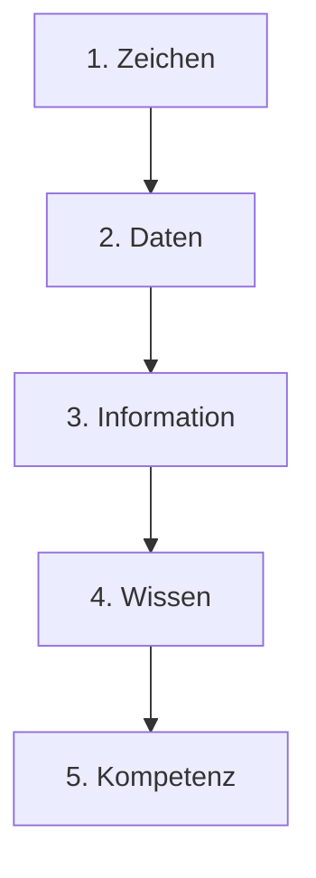
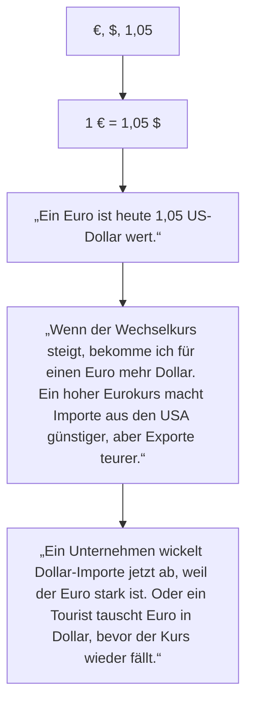
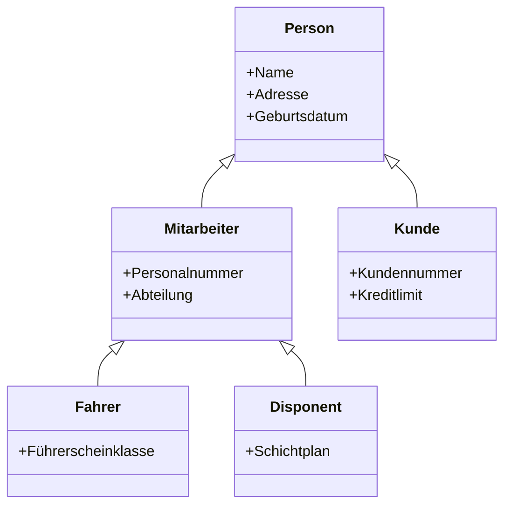

# M164

# Lernjournal Tag 1 - Repetition
## Wissenstreppe Wechselkurs

# Theorie Datenmodellierung – Zusammenfassung

## 1. Grundlagen: ERD und ERM
- **ERM (Entity-Relationship-Model):** Gesamtes Modell mit mehreren Diagrammen und Metadaten.  
- **ERD (Entity-Relationship-Diagram):** Einzelnes Diagramm mit Entitäten und Beziehungen.  
- **Entität:** Objekt mit Attributen (z. B. „Mitarbeiter“).  
- **Attribut:** Eigenschaft einer Entität (z. B. Name, Alter).  
- **Beziehung / Assoziation:** Verbindung zwischen Entitäten.  

---

## 2. Beziehungen und Kardinalitäten
- **Kardinalitäten:**  
  - `1` = genau eine  
  - `c` = null oder eine  
  - `m` = mindestens eine  
  - `mc` = null, eine oder mehrere  

- **Beziehungstypen:**  
  - Hierarchisch  
  - Konditionell  
  - Netzwerkförmig  

---

## 3. Redundanzen & Anomalien
- **Redundanz:** Mehrfach gespeicherte Daten → fehleranfällig.  
- **Anomalien:**  
  - **Einfüge-Anomalie** → Daten können nicht eingefügt werden.  
  - **Änderungs-Anomalie** → Änderungen werden inkonsistent.  
  - **Lösch-Anomalie** → Wichtige Daten gehen unbeabsichtigt verloren.  

---

## 4. Modellarten
- **Konzeptionelles Modell:** Grundkonzept, m(c):m(c) erlaubt.  
- **Logisches Modell:** Mit Attributen, PK/FK, DBMS-neutral.  
- **Physisches Modell:** DBMS-spezifische Tabellen und Datentypen.  

---

## 5. Vom Konzeptionellen zum Logischen Modell
- **Primärschlüssel (PK):** Eindeutige Identifikation.  
- **Fremdschlüssel (FK):** Verweist auf PK einer anderen Tabelle.  
- **m(c):m(c)-Auflösung:** Über Zwischentabellen.  

### Umwandlungsprozesse
- **Variante 1:** PK → m:n → FK → restliche Attribute.  
- **Variante 2:** m:n → PK → FK → restliche Attribute.  

---

## 6. Vom Logischen zum Physischen Modell
- Entitäten → Tabellen.  

### Begriffe
- Tabelle = Entität  
- Spalte = Attribut  
- Datensatz = Row  
- Feld = Value  

### DBMS-Eigenschaften
- Datentypen (`varchar`, `int`)  
- **PK:** Primary Key  
- **FK:** Foreign Key  
- **NN:** Not Null  
- **UQ:** Unique  

- In der Praxis meist als **1:N** bezeichnet.  

---

## 7. Normalformen
- **1NF:** Atomare Werte, keine Mehrfachattribute.  
- **2NF:** Keine partiellen Abhängigkeiten vom PK.  
- **3NF:** Keine transitiven Abhängigkeiten.  

---

## 8. Datenkonsistenz & Integrität
- **Datenkonsistenz:** Widerspruchsfreie Daten.  
- **Referenzielle Integrität:** FK muss auf existierenden PK zeigen.  
- **Constraints:** PK, FK, Unique, Not Null.  

---

# Beispiel Normalisierung

## Unnormalisiert
| StudentID | Name        | Kurse             | Dozent        |
|-----------|-------------|-------------------|---------------|
| 1         | Anna Meier | Mathe, Informatik | Müller, Koch |

---

## 1. Normalform (1NF)
| StudentID | Name        | Kurs        | Dozent |
|-----------|-------------|-------------|---------|
| 1         | Anna Meier | Mathe       | Müller |
| 1         | Anna Meier | Informatik  | Koch   |

---

## 2. Normalform (2NF)

### Student
| StudentID | Name        |
|-----------|-------------|
| 1         | Anna Meier |

### Belegung
| StudentID | Kurs        | Dozent |
|-----------|-------------|---------|
| 1         | Mathe       | Müller |
| 1         | Informatik  | Koch   |

---

## 3. Normalform (3NF)

### Student
| StudentID | Name        |
|-----------|-------------|
| 1         | Anna Meier |

### Kurs
| Kurs       | Dozent |
|------------|---------|
| Mathe      | Müller |
| Informatik | Koch   |

### Belegung
| StudentID | Kurs        |
|-----------|-------------|
| 1         | Mathe       |
| 1         | Informatik  |

# Lernjournal Tag 2

## Generalisierung und Spezialisierung in Datenbanken

Die Datenbankmodellierung basiert auf dem Attributkonzept, bei dem Entitätstypen durch Attribute beschrieben werden. Wenn mehrere Entitätstypen viele gemeinsame Attribute besitzen, entsteht das Problem der Redundanz, besonders wenn reale Objekte mehreren Typen zugeordnet werden (z. B. Mitarbeiter und Kunden oder Fahrer und Disponenten).

Zur Lösung wird das Konzept der **Generalisierung und Spezialisierung** verwendet:

- **Generalisierung:** Gemeinsame Attribute werden in einem übergeordneten Entitätstyp zusammengefasst (z. B. *Person*).
- **Spezialisierung:** Spezifische Attribute bleiben in den Untertypen (z. B. *Mitarbeiter*, *Kunde*).
- Es entsteht eine **„is-a“-Beziehung** (z. B. „Fahrer ist eine Person“).
- Die Untertypen werden über **Fremdschlüssel** mit dem Obertyp verbunden, um Informationsverlust zu vermeiden.
- Dieses Prinzip entspricht der **Vererbung in der objektorientierten Programmierung**.

---

## Diagramm (Mermaid)

