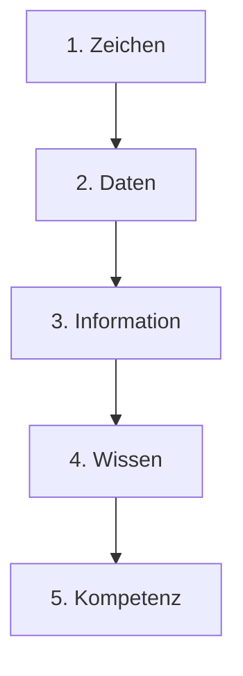
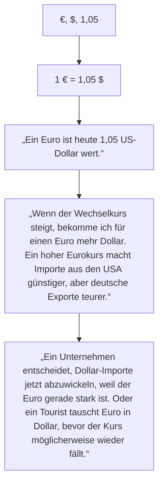

# M164

# Lernjournal Tag 1
# Wissenstreppe
# Wissenstreppe: Wechselkurs

.

# Theorie Datenmodellierung – Zusammenfassung

## 1. Grundlagen: ERD und ERM
- **ERM (Entity-Relationship-Model):** Gesamtes Modell, Sammlung von Diagrammen, kann Metadaten enthalten.  
- **ERD (Entity-Relationship-Diagram):** Einzelnes Diagramm, zeigt Entitäten und deren Beziehungen.  
- **Entität:** Objekt mit Attributen (z. B. „Mitarbeiter“ mit Vorname, Nachname …).  
- **Beziehung / Assoziation:** Verbindung zwischen Entitäten, mit **Kardinalitäten** spezifiziert.  

---

## 2. Beziehungen und Kardinalitäten
- **Kardinalitäten:** geben an, wie viele Entitäten miteinander verknüpft sind:  
  - `1` = genau eine  
  - `c` = null oder eine  
  - `m oder n` = mindestens eine  
  - `mc` = null, eine oder mehrere  

- **Beziehungstypen:**  
  - Hierarchisch  
  - Konditionell  
  - Netzwerkförmig  

---

## 3. Redundanzen & Anomalien
- **Redundanz:** Mehrfach gespeicherte Daten → fehleranfällig.  
- **Anomalien:**  
  - **Einfüge-Anomalie** → neue Daten können nicht eingefügt werden.  
  - **Änderungs-Anomalie** → gleiche Info mehrfach vorhanden, Änderungen inkonsistent.  
  - **Lösch-Anomalie** → Löschung entfernt auch wichtige Daten unbeabsichtigt.  

---

## 4. Modellarten
- **Konzeptionelles Modell:**  
  - Grundkonzept, Entitäten evtl. ohne Attribute, m(c):m(c) erlaubt.  
- **Logisches Modell:**  
  - Attribute, PK/FK, nur umsetzbare Beziehungen, DBMS-neutral.  
- **Physisches Modell:**  
  - DBMS-spezifische Datentypen, Tabellenstruktur, Constraints.  

---

## 5. Vom Konzeptionellen zum Logischen Modell
- **Primärschlüssel (PK):** Eindeutige Identifikation pro Entität.  
- **Fremdschlüssel (FK):** Referenziert PK einer anderen Tabelle.  
- **Auflösung m(c):m(c):** Einführung von Zwischentabellen (assoziative Entitäten).  

### Umwandlungsprozesse
- **Variante 1:** PK → Auflösung m:n → FK → restliche Attribute.  
- **Variante 2:** m:n → PK → FK → restliche Attribute.  

---

## 6. Vom Logischen zum Physischen Modell
- Entitäten → Tabellen.  
- **Begriffe:**  
  - Tabelle (Entität), Spalte (Attribut), Datensatz (Row), Feld (Value).  
- **DBMS-spezifische Eigenschaften:**  
  - Datentypen (z. B. `varchar`, `int`).  
  - **PK:** Primary Key  
  - **FK:** Foreign Key  
  - **NN:** Not Null (→ Unterschied zwischen `1` und `c`)  
  - **UQ:** Unique  

- In Praxis meist als **1:N** bezeichnet (entspricht 1:m oder c:m).  

---

## 7. Normalformen
- **1NF:** Atomare Werte, keine Mehrfachattribute.  
- **2NF:** 1NF + keine partiellen Abhängigkeiten vom PK.  
- **3NF:** 2NF + keine transitiven Abhängigkeiten.  

---

## 8. Datenkonsistenz & -integrität
- **Konsistenz:** Widerspruchsfreie Daten (z. B. keine doppelten Adressen).  
- **Integrität:** Regeln zur Sicherstellung korrekter Daten:  
  - **Referenzielle Integrität:** FK muss auf existierenden PK zeigen.  
  - **Constraints:** PK, FK, Unique, Not Null.  

---

## ERM

- **Entität** → ein "Ding" oder Objekt, das man in der Datenbank beschreiben will  
  *Beispiel:* Schüler, Auto, Buch  

- **Attribut** → eine Eigenschaft dieser Entität  
  *Beispiel:* Name, Geburtsdatum, Farbe  

- **Beziehung** → Verknüpfung zwischen zwei (oder mehr) Entitäten  
  *Beispiel:* Schüler **besucht** Schule, Autor **schreibt** Buch

## Normalisierung

### Normalformen

1. **1. Normalform (1NF)**
   - Mach atomar/elementar (keine Listen oder Mehrfachwerte in einer Zelle).

2. **2. Normalform (2NF)**
   - Wenn 1NF.
   - Aufgeteilt in logische Gruppen

3. **3. Normalform (3NF)**
   - Wenn 2NF.
   - Keine transitiven Abhängigkeiten (Nicht-Schlüssel-Attribute hängen nicht von anderen Nicht-Schlüssel-Attributen ab).

### Beispiel: Student belegt Kurs

#### Unnormalisiert
| StudentID | Name      | Kurse             | Dozent       |
|-----------|-----------|-------------------|--------------|
| 1         | Anna Meier| Mathe, Informatik | Müller, Koch |

---

#### 1. Normalform (1NF)
- Kurse und Dozenten werden **atomar** gespeichert.

| StudentID | Name       | Kurs        | Dozent  |
|-----------|------------|-------------|---------|
| 1         | Anna Meier | Mathe       | Müller  |
| 1         | Anna Meier | Informatik  | Koch    |

---

#### 2. Normalform (2NF)
- Trennung, damit **Nicht-Schlüssel-Attribute** nicht nur teilweise vom Schlüssel abhängen.  
- Aufteilung in zwei Tabellen: Studenten und Belegungen.

**Student**  
| StudentID | Name       |
|-----------|------------|
| 1         | Anna Meier |

**Belegung**  
| StudentID | Kurs       | Dozent  |
|-----------|------------|---------|
| 1         | Mathe      | Müller  |
| 1         | Informatik | Koch    |

---

#### 3. Normalform (3NF)
- Dozent hängt vom Kurs ab → also in eigene Tabelle auslagern.

**Student**  
| StudentID | Name       |
|-----------|------------|
| 1         | Anna Meier |

**Kurs**  
| Kurs       | Dozent  |
|------------|---------|
| Mathe      | Müller  |
| Informatik | Koch    |

**Belegung**  
| StudentID | Kurs       |
|-----------|------------|
| 1         | Mathe      |
| 1         | Informatik |

# Zusammenfassung: ERM & ERD

## 1. Grundbegriffe
- **ERD (Entity-Relationship Diagram)**
  - Einzelnes Diagramm mit Entitäten, Attributen und Beziehungen.
- **ERM (Entity-Relationship Model)**
  - Sammlung von ERDs, ggf. mit Metadaten.
- In der Praxis oft synonym verwendet.

---

## 2. Entitäten & Beziehungen
- **Entität**: Objekt mit Attributen (z. B. „Lehrperson“ mit Vorname, Nachname, Alter).  
  → Wird später zur Tabelle.
- **Beziehung/Assoziation**: Verbindung zwischen Entitäten (Linien).
- **Kardinalität**: Gibt an, wie viele Datensätze verbunden sein können.

### Kardinalitätstypen
- **1** = genau ein Datensatz  
- **c** = kein oder genau ein Datensatz  
- **m** = mindestens ein Datensatz  
- **mc** = beliebig viele Datensätze  

### Beziehungstypen
- **Hierarchisch** (1:m)  
- **Konditionell**  
- **Netzwerkförmig (m:n)**  

---

## 3. Redundanzen & Anomalien
- **Redundanz** = mehrfache Speicherung → fehleranfällig

### Anomalien
- **Einfüge-Anomalie**: Keine neuen Daten wegen PK-Konflikt  
- **Änderungs-Anomalie**: Änderung nur an einem Vorkommen → Inkonsistenz  
- **Lösch-Anomalie**: Löschen entfernt ungewollt zusätzliche Daten  

---

## 4. Datenmodelle
### a) Konzeptionelles Modell
- Abstraktes Grundkonzept  
- Entitäten & Beziehungen (wenige oder keine Attribute)  
- m:n-Beziehungen erlaubt  

### b) Logisches Modell
- DBMS-unabhängig, aber tabellenorientiert  
- Attribute, PK & FK definiert  
- m:n-Beziehungen → durch **Zwischentabellen** (Transformationstabellen) auflösen  

### c) Physisches Modell
- DBMS-spezifisch  
- Konkrete Datentypen (z. B. VARCHAR, INT)  
- Regeln wie PK, FK, Not Null (NN), Unique (UQ)  
- Begriffe: Tabelle, Spalte, Datensatz, Feld  

---

## 5. Schlüssel
- **Primärschlüssel (PK)**: Eindeutige Identifikation eines Datensatzes  
- **Fremdschlüssel (FK)**: Verweist auf PK einer anderen Tabelle, definiert Beziehungen  

---

## 6. Vom ERD zum physischen Modell
1. Primärschlüssel hinzufügen  
2. m:n-Beziehungen mit Zwischentabellen auflösen  
3. Fremdschlüssel einfügen  
4. Attribute hinzufügen  
5. Im physischen Modell DBMS-spezifische Typen wählen  

---

## 7. Normalformen
- **1NF**: Keine mehrfachen Werte, nur atomare Attribute, so klein wie möglich 
- **2NF**: wenn 1NF, Jedes Nichtschlüsselattribut hängt vom ganzen PK ab, in logische Gruppen aufteilen  
- **3NF**: wenn 2NF Keine transitiven Abhängigkeiten, keine abhängigkeit in der Tabelle z.B. Postleitzahl und Wohnort separat in neue Tabellel

---

## 8. Datenkonsistenz & Integrität
- **Datenkonsistenz** = Widerspruchsfreiheit  
- **Referenzielle Integrität** = Ein FK muss auf einen existierenden PK zeigen  
- DBMS verhindert unzulässige Verknüpfungen automatisch  

---
